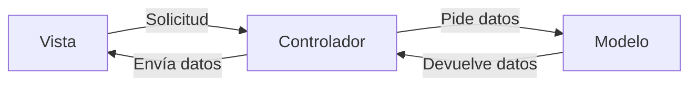

# Arquitectura MVC

El patrón **MVC** (Modelo - Vista - Controlador) es una forma de estructurar aplicaciones dividiendo la lógica en tres componentes principales:

---

## 1. Modelo

- **Responsabilidad:** Contiene **la lógica del negocio**.
- Se encarga de gestionar los datos, ya sea desde una base de datos o almacenamiento local.
- Ejemplos de fuentes de datos:
  - **mySQL**
  - **mongoDB**
  - **Local**

**Flujo desde el modelo:**

- Envía los datos al **Controlador**.
- Puede leer o modificar la información según lo que solicite el controlador.

**Ejemplo en código (JavaScript - Node.js con MongoDB):**

```javascript
// models/User.js
const mongoose = require("mongoose");

const userSchema = new mongoose.Schema({
  name: String,
  email: String,
});

module.exports = mongoose.model("User", userSchema);
```

---

## 2. Controlador

- **Responsabilidad:** Actúa como **orquestador** e **intermediario** entre el modelo y la vista.
- Recibe las solicitudes de la vista y decide qué datos necesita del modelo.
- Procesa y transforma los datos antes de enviarlos a la vista.

**Flujo del controlador:**

1. Inicia la interacción con la vista.
2. Usa la información de la vista para decidir qué hacer.
3. Pide al modelo que **lea** o **modifique** datos.
4. Recibe la respuesta del modelo y la envía a la vista.

**Ejemplo en código (JavaScript - Controlador de usuario):**

```javascript
// controllers/userController.js
const User = require("../models/User");

exports.getUsers = async (req, res) => {
  const users = await User.find();
  res.json(users);
};

exports.createUser = async (req, res) => {
  const newUser = new User(req.body);
  await newUser.save();
  res.json({ message: "Usuario creado", user: newUser });
};
```

---

## 3. Vista

- **Responsabilidad:** Presenta la **interfaz de usuario**.
- Muestra los datos proporcionados por el controlador en un formato comprensible.
- Ejemplos de tecnologías usadas:
  - **Vue**
  - **React**
  - **Next.js**
- Formato de intercambio de datos común: **JSON**.

**Flujo en la vista:**

1. Se inicia desde la vista una interacción (evento del usuario).
2. Envía la solicitud al controlador.
3. Recibe y muestra los datos procesados.

**Ejemplo en código (React):**

```javascript
// components/UserList.jsx
import { useEffect, useState } from "react";

export default function UserList() {
  const [users, setUsers] = useState([]);

  useEffect(() => {
    fetch("/api/users")
      .then((res) => res.json())
      .then((data) => setUsers(data));
  }, []);

  return (
    <ul>
      {users.map((user) => (
        <li key={user._id}>
          {user.name} - {user.email}
        </li>
      ))}
    </ul>
  );
}
```

---

## Flujo General MVC (según la imagen)

0. El modelo envía datos al controlador.
1. La vista inicia la interacción.
2. El controlador usa la información de la vista.
3. El controlador lee o modifica datos en el modelo.

---

### Ventajas del MVC

- Separación clara de responsabilidades.
- Facilita el mantenimiento y escalabilidad.
- Permite trabajar en paralelo entre diseño (vista) y lógica (modelo/controlador).

---

## Reglas de oro

1. La Vista nunca toca la base de datos → pasa siempre por el Controlador.
2. El Modelo no conoce la Vista → solo devuelve datos, nunca HTML.
3. El Controlador debe ser ligero → delega lógica al Modelo y presentación a la Vista.

---

**Ejemplo visual en diagrama:**


