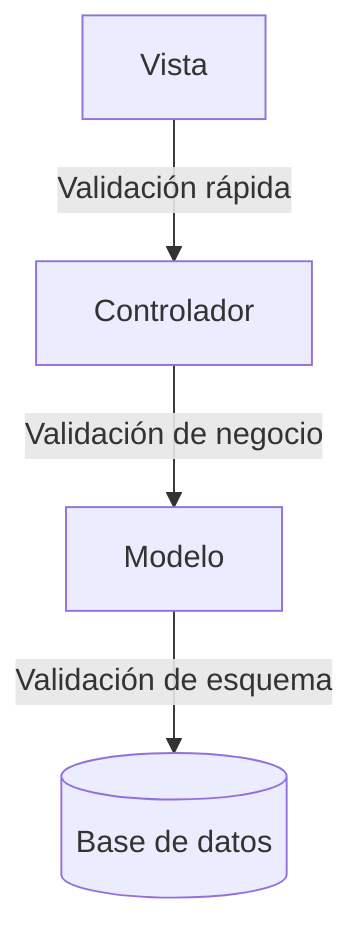

# Validación de Datos en la Arquitectura MVC

> Objetivo: entender **dónde y cómo validar datos** en cada capa (Modelo, Vista, Controlador) para mantener la integridad del sistema.

---

## 1. Vista (Validación básica y experiencia de usuario)

- **Responsabilidad:** Evitar que el usuario envíe datos claramente incorrectos antes de llegar al servidor.
- Se realiza mediante validaciones en el cliente (JavaScript, HTML5).
- Mejora la experiencia de usuario pero **no sustituye** la validación en el servidor.

**Ejemplo en React (validación de formulario):**

```jsx
function UserForm() {
  const [email, setEmail] = React.useState("");
  const [error, setError] = React.useState("");

  const handleSubmit = (e) => {
    e.preventDefault();
    if (!email.includes("@")) {
      setError("Email inválido");
      return;
    }
    // Enviar datos si son válidos
    fetch("/api/users", { method: "POST", body: JSON.stringify({ email }) });
  };

  return (
    <form onSubmit={handleSubmit}>
      <input
        type="email"
        value={email}
        onChange={(e) => setEmail(e.target.value)}
        required
      />
      {error && <span>{error}</span>}
      <button type="submit">Guardar</button>
    </form>
  );
}
```

---

## 2. Controlador (Validación de negocio y seguridad)

- **Responsabilidad:** Validar que los datos recibidos cumplen con las reglas del negocio antes de llegar al modelo.
- Aquí se evita que datos malintencionados o corruptos pasen al sistema.
- Ejemplo de validaciones:
  - Campos requeridos.
  - Tipos de datos.
  - Valores dentro de un rango permitido.

**Ejemplo en Next.js API Route usando `yup`:**

```js
import * as yup from "yup";
import UserModel from "../../models/UserModel";

const schema = yup.object({
  name: yup.string().min(3).required(),
  email: yup.string().email().required(),
});

export default async function handler(req, res) {
  if (req.method === "POST") {
    try {
      const validData = await schema.validate(req.body);
      const user = await UserModel.create(validData);
      return res.status(201).json(user);
    } catch (err) {
      return res.status(400).json({ error: err.message });
    }
  }
}
```

---

## 3. Modelo (Validación de persistencia y consistencia)

- **Responsabilidad:** Garantizar la integridad y la coherencia de los datos; asegurar que los datos guardados cumplen con la estructura y reglas de la base de datos.
- Validaciones típicas:
  - Tipos de datos.
  - Campos obligatorios.
  - Valores únicos.

**Ejemplo con Mongoose:**

```js
import mongoose from "mongoose";

const UserSchema = new mongoose.Schema({
  name: { type: String, required: true, minlength: 3 },
  email: { type: String, required: true, unique: true, match: /.+@.+\..+/ },
});

export default mongoose.models.User || mongoose.model("User", UserSchema);
```

---

## 4. Regla de oro

> **Valida en las tres capas.**
>
> - **Vista:** Evita errores simples y mejora UX.
> - **Controlador:** Protege la lógica del negocio y la seguridad.
> - **Modelo:** Garantiza integridad en la base de datos.

---

## 5. Flujo visual de validación



---

## 6. Beneficios de validar en todas las capas

- **Seguridad**: Bloquea inyecciones y datos maliciosos.
- **Integridad**: Garantiza consistencia en la base de datos.
- **Confianza**: Los usuarios saben que sus datos están protegidos y son tratados correctamente.
