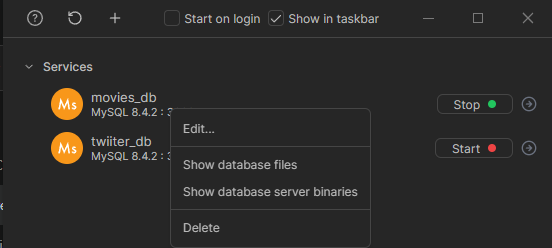
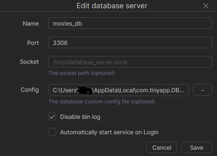
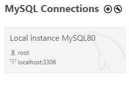
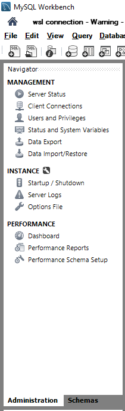
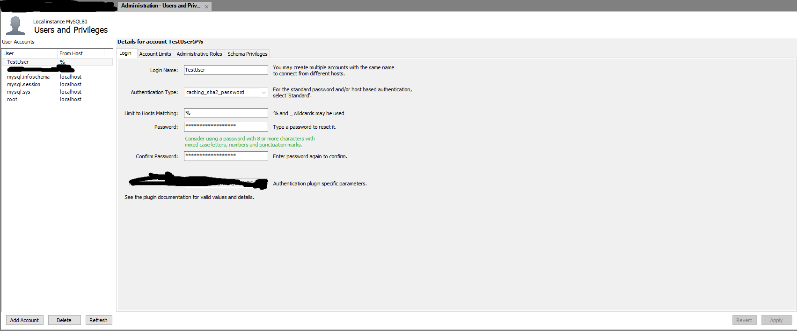
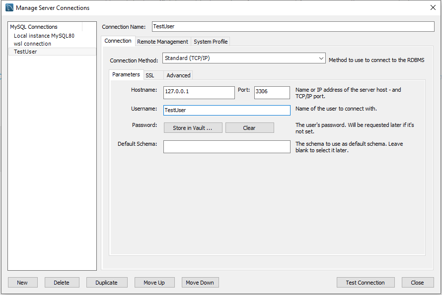

# Explicación **PASO A PASO** para conectarse desde **WSL** a **DBngin** con mySQL y mySQL Workbench

> Al usar **Windows WSL** cuando estamos en **WSL** usamos otra red de internet diferente a **Windows** ya que es un contenedor virtual dentro del mismo.  
> Si queremos más de una instancia de la base de datos debemos crearla en otro `PORT` o si intentamos abrir dos instancias en el mismo puerto nos dará error.

- Cuando usamos host `localhost` usa normalmente la IP `127.0.0.1`, pero no se comparten entre Windows y Linux (WSL).

- Para averiguar la IP que vincula **WSL** a **Windows**:
  - Abrir la consola de Windows `window + R` escribimos cmd y presionamos `Enter`.
  - Escribir ipconfig y a continuación nos saldrá lo siguiente, la IP que usará de salida WSL será dentro de `Adaptador de Ethernet vEthernet (WSL):` `Dirección IPv4. . . . . . . . . . . . . . : ***.**.**.* `

[IMAGEN DE EJEMPLO](1.ipconfig.png)

```cmd
C:\Users\<usuario>>ipconfig

Configuración IP de Windows


Adaptador de Ethernet Ethernet:

   Sufijo DNS específico para la conexión. . :
   Vínculo: dirección IPv6 local. . . : ****::****:****:****:****%*
   Dirección IPv4. . . . . . . . . . . . . . : ***.***.*.**
   Máscara de subred . . . . . . . . . . . . : ***.***.***.*
   Puerta de enlace predeterminada . . . . . : ***.***.*.*

Adaptador de Ethernet vEthernet (WSL):

   Sufijo DNS específico para la conexión. . :
   Vínculo: dirección IPv6 local. . . : ****::****:****:****:****%**
   Dirección IPv4. . . . . . . . . . . . . . : ***.**.**.*  <-------ESTA ES !!!
   Máscara de subred . . . . . . . . . . . . : ***.***.***.*
   Puerta de enlace predeterminada . . . . . :
```

## 1. PASO

### DBngin

1. Si usamos **DBngin** tenemos que ir a la ruta `C:\Users\<usuario>\AppData\Local\com.tinyapp.DBngin\Data` y dentro crear un archivo `my.ini` o `my.cnf` con la siguiente configuración.

```ini
[mysqld]
# Puerto de MySQL
port = 3306

# Permitir conexiones desde cualquier IP (no solo localhost)
bind-address = 0.0.0.0
```

### ---> **IMPORTANTE** `bind-address = 0.0.0.0` escucha todos los puertos, debemos limitar los que queramos.

2. Después abrimos **DBngin**, hacemos click derecho en la base creada y pinchamos `Edit`.



3. Se nos abrira una nueva pestaña y en el apartado `Config` seleccionamos la carpeta que creamos antes (`my.ini` o `my.cnf`).



### MySql Server

1. Si usamos **MySql Server** tenemos que ir a la ruta `C:\ProgramData\MySQL\MySQL Server 8.0\` y abrir un archivo `my.ini` o `my.cnf` y agregar esto al archivo.

```ini
[mysqld]
# Puerto de MySQL
port = 3306

# Permitir conexiones desde cualquier IP (no solo localhost)
bind-address = 0.0.0.0
```

### ---> **IMPORTANTE** `bind-address = 0.0.0.0` escucha todos los puertos, debemos limitar los que queramos.

## 2. PASO

### En MySQL Workbench instalado en Windows

1. Abrimos el Workbench accedemos con el usuario `root` host `localhost` port `3306` por defecto.



2. Vamos en la parte izquierda al apartado de Users and Privilieges.



3. Una vez dentro abajo a la izquierda le das a `Add Account`, eliges el nombre de usuario la contraseña y en el apartado de `Limit to Host Matching` eliges la o las IP's desde las que tiene permiso para conectarse. **PD**: si pones `%` das permisos a cualquier IP, no es seguro!!! Por útimo le das a Apply abajo a la derecha.



## 3. PASO

### En nodejs nos conectamos de la siguiente manera:

```js
import mysql from "mysql2/promise";
import "dotenv/config";

const config = {
  host: "???.??.??.?", // al tener la db en window y hacer la peticion en wsl no puedo acceder por socket o con localhost
  port: 3306,
  user: "arturo",
  password: process.env.MYSQL_ROOT_PASSWORD,
  database: "mysql_db",
};

const connection = await mysql.createConnection(config);
```

### En el Workbench

1. Creamos la conexión .

2. Selecionamos el `Username` que creamos, la IP a la que dimos permisos en el `Hostname` ej: `127.0.0.1`, el `PORT` `3306` por defecto y al intentar conectarnos nos pedira la contraseña.



### Desde la terminal de WSL

```wsl
mysql -h <ip-con-permisos> -u <usuario> -p
```

> No usar prefijo `sudo` para dar permisos de administrador porque por defecto simepre inicia sesión con `root`, a no ser que tu usuario sea `root`.
> Probablemente si no tienes insataldo el cliente de mysql para wsl te pedirá instalarlo y el -p es para que te pida la contraseña para conectarte.

#### **PD:** Si quieres acceder desde otra máquina distinta, tendrás que abrir el puerto que necesites en el firewall de windows para permitir acceso del exterior y probablemente también en la configuración de tu router.

# Script para matar el proceso de mysql y reiniciar DBngin si se queda pillado.

## **!!! IMPORTANTE, tiene riesgos !!!**

Creas un archivo.bat si estás en Windows lo ejecutas cuando se quede pillada tu DB.

```bat
@echo off
:: Script para reiniciar MySQL y Dbngin de forma segura
:: Ejecutar como Administrador

echo Cerrando Dbngin (con procesos hijos)...
taskkill /F /T /IM dbngin-go.exe >nul 2>&1
timeout /t 2 /nobreak >nul

echo Cerrando mysqld.exe si está activo...
taskkill /F /IM mysqld.exe >nul 2>&1
timeout /t 2 /nobreak >nul

:: Ruta de Dbngin (ajústala si es necesario)
set DBNGIN_PATH="C:\Users\artur\AppData\Roaming\DBngin\dbngin-go.exe"

echo Reiniciando Dbngin...
start "" %DBNGIN_PATH%

echo Listo. MySQL y Dbngin deberían poder iniciarse y detenerse correctamente.
pause

```

No elimina tu base de datos, simplemente fuerza a detener el proceso del servidor MySQL que está corriendo en memoria.

## 🔹 Qué hace:

- Cierra MySQL inmediatamente, sin pedirle que se apague de forma ordenada.

- Los archivos de datos (ibdata1, .ibd, .frm, etc.) se quedan intactos en disco.

- La próxima vez que lo inicies, MySQL intentará recuperar el estado usando el log de transacciones.

## 🔹 Riesgo:

- Si había transacciones abiertas o escritura en curso, al forzar el cierre podrías provocar inconsistencias o que MySQL tenga que hacer una recuperación al reiniciar.

- No es recomendable como método habitual, pero en tu caso (el proceso quedó “huérfano” sin control de DBngin) es la forma de liberarlo.
